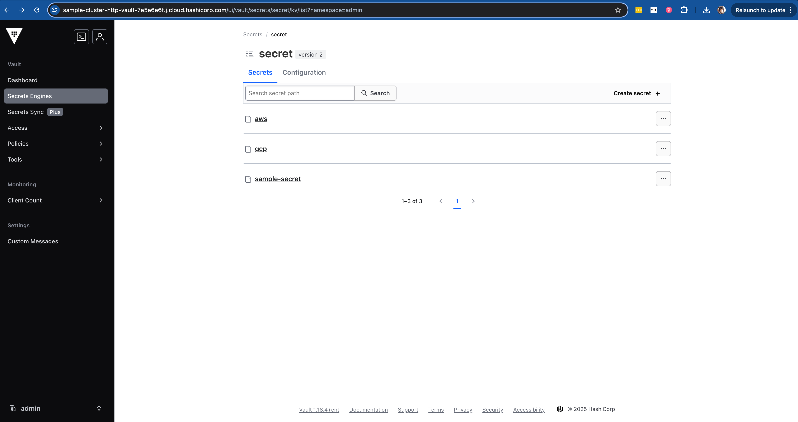

# Terraform Multi-Cloud Demo with HCP Vault

This project demonstrates a multi-cloud infrastructure setup using Terraform, with AWS and GCP resources, and secure secret management using HashiCorp Cloud Platform (HCP) Vault.

## Addressing ACME Corp's Multi-Cloud Transition

This demo directly addresses ACME Corp's strategic shift from AWS dependency to a multi-cloud approach, showcasing how Terraform can serve as a unified provisioning and automation strategy. Here's how this demo meets ACME's requirements:

### 1. Multi-Cloud Provisioning
- **AWS and GCP Integration**: Demonstrates provisioning across multiple cloud providers
- **Unified Configuration**: Single Terraform configuration managing resources across platforms
- **Consistent Workflow**: Same commands and processes regardless of the target platform

### 2. Enterprise-Grade Features
- **Remote State Management**: Using Terraform Cloud for secure state storage
- **Secret Management**: Integration with HCP Vault for secure credential handling
- **Policy Enforcement**: Sentinel policies for cost control and compliance
- **Cost Estimation**: Built-in cost tracking and optimization features

### 3. Migration Path from Current Tools
- **Python Scripts**: Terraform's declarative approach replaces imperative scripting
- **ServiceNow**: Automated provisioning reduces manual ticket creation
- **Ansible**: Terraform handles infrastructure provisioning while Ansible can focus on configuration

### 4. Technical Demonstration
- **VM Provisioning**: Creates EC2 instances in AWS and Compute Engine instances in GCP
- **Multi-Tier Setup**: Demonstrates infrastructure across multiple cloud providers
- **Security Best Practices**: Implements secure credential management
- **Cost Control**: Shows how to prevent expensive resource provisioning

### 5. Enterprise Readiness
- **Version Control**: Full Git integration for infrastructure changes
- **Collaboration**: Team-based access control and audit logging
- **Compliance**: Policy enforcement through Sentinel
- **Documentation**: Comprehensive README and inline code documentation

## Architecture

- **Infrastructure**: AWS EC2 and GCP Compute Engine instances
- **Secret Management**: HCP Vault for secure credential storage
- **State Management**: Terraform Cloud for remote state and execution
- **Policy Enforcement**: Sentinel policies for cost control
- **Cost Management**: HCP Terraform cost estimation and tracking

## HCP Terraform Integration

HCP Terraform (formerly Terraform Cloud) provides a robust platform for managing infrastructure as code. This project leverages HCP Terraform for:

1. **Remote State Management**
   - Secure storage of Terraform state
   - State locking to prevent concurrent modifications
   - Version history of infrastructure changes

2. **Remote Execution**
   - Consistent execution environment
   - No need for local credentials
   - Automated runs on code changes

3. **Collaboration Features**
   - Team-based access control
   - Run history and audit logs
   - Integration with version control systems


The image above shows the HCP Terraform interface displaying run history, plan outputs, and cost estimates for our infrastructure changes.

## Prerequisites

1. **HCP Vault Cluster**
   - A running HCP Vault cluster
   - Vault address and token with appropriate permissions
   - KV secrets engine enabled (version 2)

2. **Terraform Cloud**
   - Organization: `alexcho-demo`
   - Workspace: `terraform_demo_2`
   - Required variables configured
   - Cost estimation enabled

3. **Cloud Provider Access**
   - AWS credentials stored in HCP Vault
   - GCP service account credentials stored in HCP Vault

## Secret Management

### HCP Vault Setup

1. **Enable KV Secrets Engine**
   ```bash
   # In HCP Vault UI:
   # 1. Go to Secrets
   # 2. Enable new engine
   # 3. Select KV
   # 4. Version: 2
   # 5. Path: secret
   ```

2. **Store AWS Credentials**
   ```bash
   # Path: secret/aws
   {
     "access_key": "your-aws-access-key",
     "secret_key": "your-aws-secret-key"
   }
   ```

3. **Store GCP Credentials**
   ```bash
   # Path: secret/gcp
   {
     "credentials": "your-gcp-service-account-json"
   }
   ```



The image above shows the HCP Vault interface where we store and manage our cloud provider credentials securely.

### Required Terraform Cloud Variables

- `vault_addr`: HCP Vault cluster address
- `vault_token`: HCP Vault token (sensitive)
- `gcp_project_id`: GCP project ID
- `aws_instance_type`: AWS instance type (default: t2.micro)
- `gcp_machine_type`: GCP machine type (default: e2-micro)

## Cost Management

HCP Terraform provides built-in cost estimation capabilities that help you understand and manage your infrastructure costs:

### Cost Estimation Features

1. **Pre-apply Cost Estimates**
   - Automatically calculates estimated monthly costs for planned changes
   - Breaks down costs by resource and provider
   - Shows cost impact of infrastructure changes before they're applied

2. **Cost Tracking**
   - Tracks actual costs of deployed resources
   - Compares estimated vs. actual costs
   - Provides cost history and trends

3. **Cost Optimization**
   - Identifies potential cost savings
   - Suggests alternative resource configurations
   - Helps maintain budget compliance

### Example Cost Estimate Output
```
Cost Estimation:

Resources: 2 of 2 estimated
           $80.81/mo +$80.81

AWS:
  aws_instance.demo: $30.40/mo
GCP:
  google_compute_instance.demo: $50.41/mo
```


## Policy Enforcement

The project includes Sentinel policies to enforce:
- Cost control by restricting high-cost instance types
- Security best practices
- Resource naming conventions

## Usage

1. **Initialize Terraform**
   ```bash
   terraform init
   ```
   This command initializes the working directory containing Terraform configuration files.

   

2. **Plan Changes**
   ```bash
   terraform plan
   ```
   This command creates an execution plan, showing what actions Terraform will take to reach the desired state.

   

3. **Apply Changes**
   ```bash
   terraform apply
   ```
   This command applies the changes required to reach the desired state of the configuration.

   

4. **State Management**
   ```bash
   # Pull the current state
   terraform state pull

   # Show specific resource state
   terraform state show aws_instance.demo
   ```
   These commands help manage and inspect the Terraform state.

   
   

## Security Notes

- All sensitive credentials are stored in HCP Vault
- Terraform Cloud variables are marked as sensitive where appropriate
- Access to HCP Vault is controlled via tokens and policies
- Regular rotation of credentials is recommended

## Cost Control

The project includes Sentinel policies that prevent the use of high-cost instance types:
- AWS: Blocks instance types like m5.24xlarge, c5.24xlarge, etc.
- GCP: Blocks machine types like n1-ultramem-160, n2-ultramem-160, etc.

## Contributing

1. Fork the repository
2. Create a feature branch
3. Commit your changes
4. Push to the branch
5. Create a Pull Request

## License

This project is licensed under the MIT License - see the LICENSE file for details.