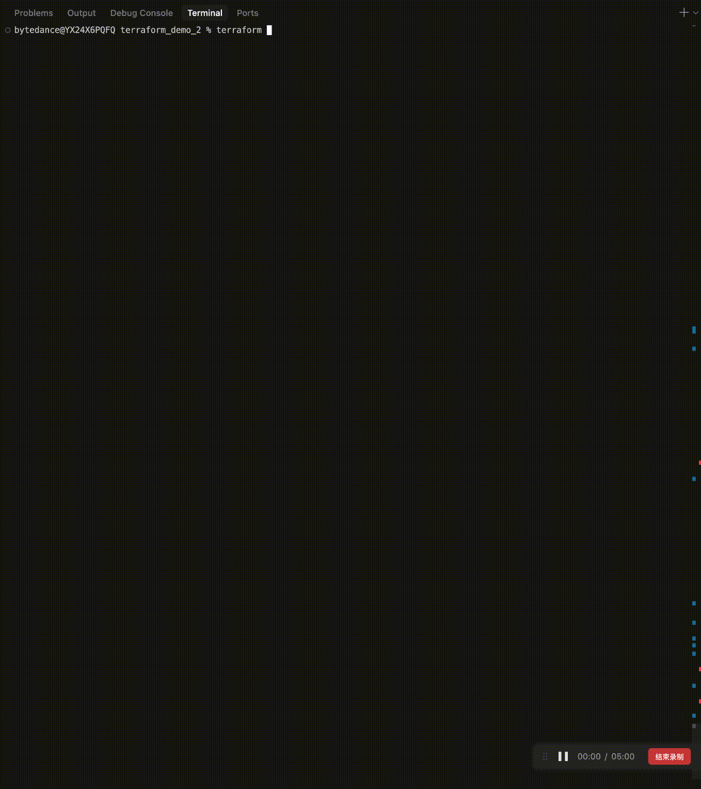
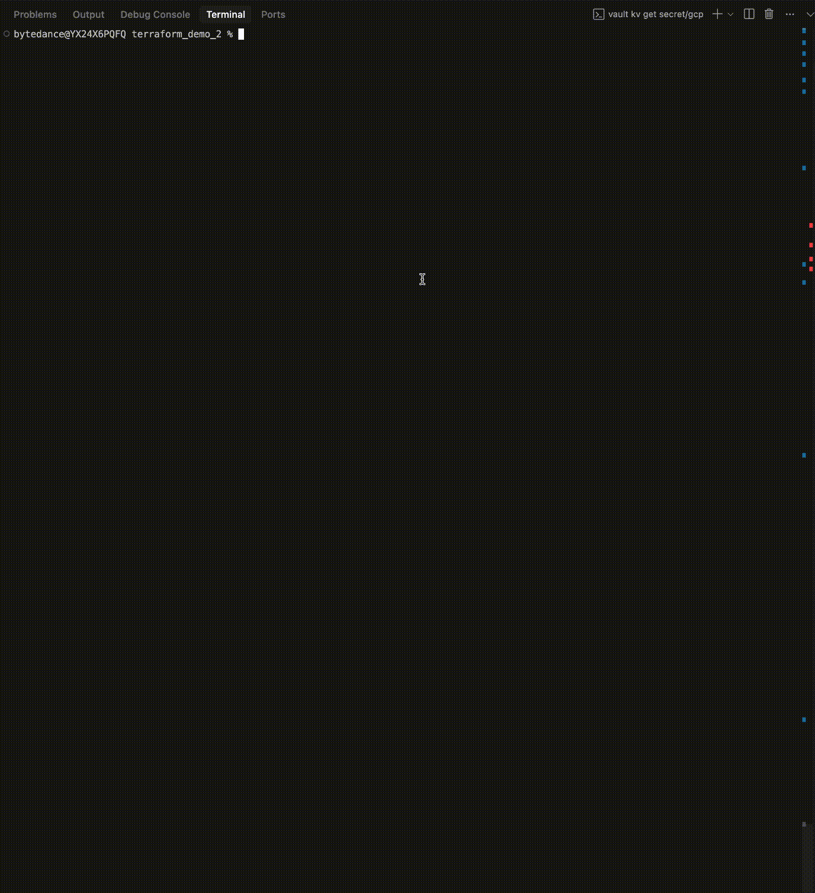
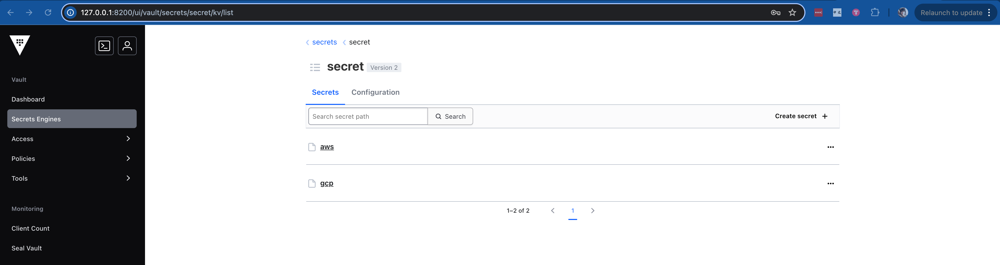

# Simple Terraform Multi-Cloud Demo

## How This Demo Fulfills the ACME Corp Multi-Cloud Briefing

This repository demonstrates how Terraform enables multi-cloud provisioning and infrastructure as code (IaC) in response to ACME Corp's strategic shift away from AWS dependency. The demo showcases:

- **Multi-Cloud Provisioning:** The included Terraform code provisions compute resources in both AWS and GCP, illustrating how a single IaC tool can manage infrastructure across multiple cloud providers.
- **Unified Workflow:** By using Terraform, teams can replace custom scripts, ServiceNow, and Ansible with a consistent, declarative approach to infrastructure management.
- **Secrets Management:** Integration with HashiCorp Vault ensures that sensitive credentials are managed securely and not hardcoded, supporting enterprise security requirements.
- **Live Demonstration Ready:** The code is ready for a live demo, showing real provisioning of VMs on both AWS and GCP, fulfilling the technical exercise and meeting objectives.
- **Extensibility:** The approach can be extended to other platforms (Azure, VMware, OpenStack, etc.) with minimal changes, supporting future growth and platform diversity.

This demo is designed for evaluation by ACME Corp's leadership, architects, DevOps, and SRE teams, and provides a clear, hands-on example of how Terraform can unify and simplify multi-cloud infrastructure provisioning.

## Prerequisites

1. Terraform installed (version >= 1.0.0)
2. HashiCorp Vault installed
3. AWS account with appropriate permissions
4. GCP project with billing enabled

## Setup

1. Start Vault in dev mode:
   ```bash
   vault server -dev -dev-root-token-id=root
   ```

2. Set Vault environment variables:
   ```bash
   export VAULT_ADDR='http://127.0.0.1:8200'
   export VAULT_TOKEN='root'  # or your Vault token
   ```

3. Store AWS credentials in Vault:
   ```bash
   vault kv put secret/aws access_key=YOUR_AWS_ACCESS_KEY secret_key=YOUR_AWS_SECRET_KEY
   ```

4. Store GCP credentials in Vault:
   ```bash
   vault kv put secret/gcp credentials=@/path/to/your/gcp-credentials.json
   ```

## Command Examples

This section demonstrates common Terraform and Vault commands with their outputs.

### Context
In this demo, we're upgrading our compute resources to more powerful instances:
- AWS: Upgrading from t2.micro to t3.medium (2 vCPU, 4 GB RAM)
- GCP: Upgrading from e2-micro to e2-standard-2 (2 vCPU, 8 GB RAM)

These changes are defined in our `terraform.tfvars` file and will be applied using the commands shown below.

### Terraform Commands

#### Initialize Terraform
```bash
terraform init
```


#### Plan Changes
```bash
terraform plan
```


#### Apply Changes
```bash
terraform apply
```


#### State Management
```bash
# Pull current state
terraform state pull

# Show specific resource state
terraform state show 'aws_instance.example'
```



### Vault Credentials

#### View AWS and GCP Credentials
```bash
vault kv get secret/aws
vault kv get secret/gcp
```


## Resources Created

- AWS: t3.medium EC2 instance running Amazon Linux 2
- GCP: e2-standard-2 Compute Engine instance running Debian 11

## Security Notes

- All credentials are stored in HashiCorp Vault
- No credentials are stored in code or environment variables
- Vault provides secure storage and access control for credentials

## Configuration

1. Update the GCP project ID in `main.tf`:
   ```hcl
   provider "google" {
     project = "your-gcp-project-id"  # Replace with your GCP project ID
     region  = "us-central1"
   }
   ```

2. (Optional) Update the AWS region if needed:
   ```hcl
   provider "aws" {
     region = "us-west-2"  # Change if needed
   }
   ```

## Usage

1. Initialize Terraform:
   ```bash
   terraform init
   ```

2. Review the planned changes:
   ```bash
   terraform plan
   ```

3. Apply the configuration:
   ```bash
   terraform apply
   ```

4. When done, destroy the resources:
   ```bash
   terraform destroy
   ```